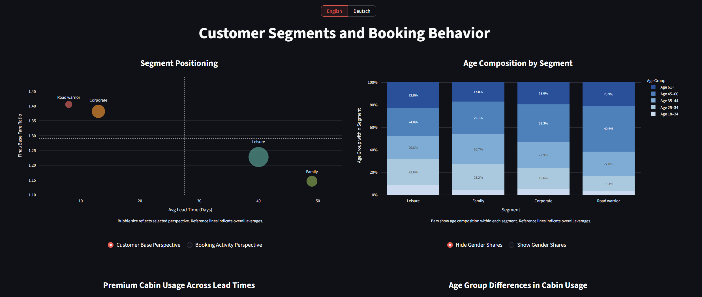

# Customer Segments and Booking Behavior

## Overview

This project analyzes how different customer segments behave in an airline booking environment, focusing on:

- booking timing (lead time)
- pricing outcomes
- cabin class usage
- demographic composition

The dataset is **simulated but behaviorally realistic**, enabling meaningful analysis without relying on proprietary 
data.

🔗 **Live Dashboard:** [Streamlit App Link](https://customersegmentsbookingbehavior.streamlit.app/)  
🔗 **Dataset Source:** [Simulated Airline Database Link](https://github.com/publiusTacitus/simulated_airline_database)

---

## Dashboard

Built with **Streamlit + Plotly**, the dashboard provides:

- segment positioning (behavior vs pricing)
- age and gender composition
- cabin usage patterns
- lead time distributions and fare outcomes

Includes **English/German localization** with translated UI and number formatting.

---

## Data

Based on two core tables:

- `customers` (customer-level attributes)
- `bookings` (transaction-level behavior)

The data generation introduces controlled relationships:

- age ↔ cabin usage  
- traveller type ↔ booking frequency  
- lead time ↔ pricing  
- loyalty status ↔ discounts  

This creates realistic behavioral patterns suitable for analysis.

---

## Key Insights

### Segment Economics

- **Leisure + Family**: ~70% of customers, ~25% of bookings  
- **Corporate + Road Warriors**: minority of customers, majority of bookings  
- Booking frequency – not population size – drives revenue relevance  

---

### Pricing Dynamics

- Longer lead times → lower prices  
- Short-notice bookings carry strong price premiums  

- Lowest: *Family, 60+ days* → **1.08**  
- Highest: *Corporate, 1–3 days* → **1.50**

Road warriors pay slightly less than corporate within the same lead time window, likely due to loyalty discounts.

---

### Cabin Usage

- Premium cabin usage increases as lead time decreases  
- Age is a stronger driver than gender  

- **Age 45–60**: highest premium usage and check-in rates  
- **Age 18–24**: highest economy share, lowest reliability  

---

### Booking Timing

- **Leisure / Family**: concentrated in long lead times (30–60+ days)  
- **Corporate / Road Warriors**: strong short-notice activity (1–14 days)  

Clear separation between planned vs reactive travel behavior.

---

### Demographics

- Leisure: balanced, slightly older skew  
- Family: concentrated in Age 35–60  
- Corporate / Road Warriors: strongly skewed toward Age 45–60  

---

## Design Highlights

- **Color system**
  - Blue → age-related analysis  
  - Purple → lead time analysis  

- **Interactivity**
  - customer vs booking perspective toggle  
  - optional gender overlays  
  - detailed hover-level metrics  

- **Localization**
  - full English/German support  
  - consistent translation layer across UI and data labels  

---

## Technical Approach

### Data Pipeline

- SQL queries designed for analytical clarity (`sql_queries/`)
- Transformed for dashboard use via Jupyter (`util/`)
- Exported as CSV for fast, dependency-free loading

---

### Performance

- Precomputed datasets (CSV)
- Cached loading via `st.cache_data`

→ fast, stable, no live database required

---

## Structure

| Folder / File      | Description                       |
|--------------------|-----------------------------------|
| `assets/`          | Precomputed data and translations |
| `sql_queries/`     | Analytical SQL (PostgreSQL)       |
| `util/`            | Transformations and helpers       |
| `streamlit_app.py` | Dashboard                         |

---

## Notes

This project emphasizes:

- behavioral realism over raw data size  
- clear segmentation over generic aggregation  
- interactive exploration over static reporting  

It demonstrates how structured simulation + targeted SQL + focused visualization can replicate real-world analytical 
scenarios.

---

## Author
Jan H. Schüttler ([LinkedIn](https://www.linkedin.com/in/jan-heinrich-sch%C3%BCttler-64b872396/))